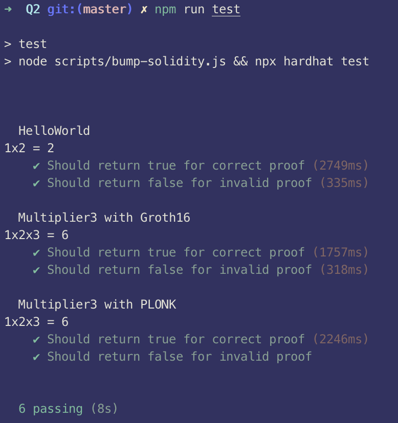

# Part 1

Groth16 and PLONK are two types of SNARK proofs.

STARK uses publicly verifiable randomness sources. On the other hand, SNARKs require a trusted setup to avoid any single entity generate all of the required parameters for the SNARK proofs.

Additional differences between SNARK and STARK proofs:

- STARKs address scalability issues with SNARKs by reducing computational efforts with less algebraic, arithmetic representations.
- SNARKs use public-privat key pairs for encryption which is susceptible to quantum attacks. STARKs use collision-resistant hash functions and random oracle models to defend against this attack vector.

# Part 2 Getting started with circom and snarkjs

### Part 2.2 What does `HelloWorld.circom` do?

The circuit in `HelloWorld.circom` takes two input signals `a` and `b` and multiplies them together to get the output signal `c`.

The prover needs to prove to a verifier that they know of two inputs `a` and `b` such that, when multiplied together, produces `c`. The output signal `c` is public to anyone including the verifier, whereas `a` and `b` are meant to be kept private from the verifier.

### Part 2.2 What is Powers of Tau ceremony?

Each zk-SNARK application requires parameters such as proving and verifying keys to be generated in order to be functioning. In public systems where anyone can be a prover and a verifier, it is necessary to avoid having any single entity generate all of the required parameters, hence a setup phase(s) involving multiple parties is one way to mitigate trust assumptions. Trust is necessary here since "toxic waste" is created as part of the parameter generation process and participants of this process are expected to destroy such toxic waste. If all participants were **not** to destroy their local toxic waste, it is possible for anyone to produce fake proofs which undermine the security of zk-SNARKs. Therefore, a secure parameter generation scheme would involve a trusted setup with multi-party computation that can involve a large number of participants where security holds unless all parties are malicious or compromised. In other words, as long as 1 party behaves honestly and destroys their local toxic waste, the security of the generated parameters hold.

As parameter generation is an expensive operation in both computational and time aspects (at least), a trusted setup can be designed as two phases. The first phase generates the majority of the required parameters, is independent of the circuits that are used by the zk-SNARK applications, and can be reused globally across all zk-SNARK applications. The second phase generates the remainder of the parameters and is the only part of the process that is application / team dependent.

A Powers of Tau ceremony is a Phase 1 multi-party computation ceremony where participants take turns performing computations in order to collectively generate new zk-SNARK parameters. This ceremony generates most of the random toxic waste. This is a perpetual ceremony meaning there is no limit to the number of participants required, and more participants can join at any time to add their computation to a public transcript. This ceremony is secure since it is unlikely that an adversary could compromise everyone as more participants add their computation ("attestations") to the public transcript. The difficulty in compromising everyone is because participants have a high degree of flexibility in deciding their source of randomness - for example, Andrew Miller flew over Chernobyl to use radioactivity as a source of randomness. Any zk-SNARK application can pick any point of the ceremony to begin their circuit-specific second phase. During the Powers of Tau ceremony, each participant will receive a challenge file and must generate a response file in a secure and honest manner.

### Part 2.2 Phase 1 and Phase 2 ceremonies

Phase 1 ceremonies such as Powers of Tau can be reused as it is not circuit-specific. Phase 2 ceremonies involves generating a zero-knowledge key, `zkey`, and then using it to make Phase 2 ceremony contributions to the trusted setup. Zero -knowledge keys can be verified to check whether they belong to a specific circuit or not. Otherwise, Phase 1 and Phase 2 ceremonies are similar in their process of having participants / zkeys make contributions to a running "transcript" of attestations.

### Part 2.3 Error running `compile-Multiplier3-groth16.sh` as-is

The errors observed when running the bash script as-is when modelled after `compile-HelloWorld.sh` is that the compilation error with Multiplier3.circom is the root cause for the subsequent observed errors with SnarkJS which cannot find the .r1cs and .zkey files - the compilation error resulted in these files not being generated.

The root error is because circom does not allow writing circuits to be written with non quadratic expressions - these are expressions that **are not** constant values, linear expressions, or quadratic expressions. Linear expressions are expressions where there is only addition of variables multiplied by constants. Quadratic expressions are of the form `A*B - C` where `A`, `B` and `C` are linear expressions. In `Multiplier3.circom`, the expression `a * b * c` directly violates circom's restriction.

The fix is to introduce an intermediate, private (by default) signal `inter` that holds the output of `a * b`, which is then fed as an input to be multiplied by `c` before being output to the `d` signal.

### Part 2.4 Groth16 vs. PLONK

Groth16 requires a trusted ceremony for each circuit, while PLONK does not and it's enough to only use the output from the Powers of Tau ceremony, which is universal. Hence, there is no need to make an additional Phase 2 contribution as in the Groth16 compilation process in `compile-Multiplier3-groth16.sh`, and we simply export the verification key right after generating the `zkey` - no need to run `snarkjs zkey contribute`.

Practically, Groth16 is able to generate (correct) proofs faster than PLONK - Groth16 took 1.7s and PLONK took 2.2s. For false proofs, especially in the special case of providing zero values as in the code in this repository, Groth16 took longer than PLONK - Groth16 took 0.3s and PLONK was almost instantaneous.



# Part 3 Reading and designing circuits with circom

### Part 3.1 LessThan10

Within circomlib's [`comparators.circom` file](https://github.com/iden3/circomlib/blob/master/circuits/comparators.circom), the `LessThan` template is defined with a single parameter, `n`, which refers to the number of bits the inputs would have, with the most-significant (left-most) bit being the sign bit. This means that, on L9, we are instantiating the `LessThan` template to support comparisons of 32 bit signed integers.

The possible outputs for the `LessThan` template is either `1` or `0` - `1` when the input value is less than 10 (true case), `0` when the input value is greater or equal than 10 (false case).

### Part 3.2 sudoku compile error

The following error is encountered when attempting to run a full proof of the sudoku circuit:

```bash
[ERROR] snarkJS: circuit too big for this power of tau ceremony. 70534 > 2\*\*16
[ERROR] snarkJS: Error: build/sudoku/circuit_final.zkey: Invalid File format
[ERROR] snarkJS: Error: build/sudoku/circuit_final.zkey: Invalid File format
```

This is because the downloaded Powers of Tau ceremony is powersOfTau28_hez_final_16.ptau which only supports 2^16 (or 64k) constraints, and the PLONK constraints needed by the sudoku circuit is 70534, which is greater than what is supported.

To resolve this issue, I replaced all appearances of `powersOfTau28_hez_final_16` in the `compile-circuits.sh` file with `powersOfTau28_hez_final_17`, meaning that the compilation would be using a Powers of Tau ceremony that supports a larger number of constraints, specifically, 2^17 (or 128k) constraints.

### Part 3.2 sudoku verification implementation

The algorithmic implementation has a better time and space complexity over the brute force method.
